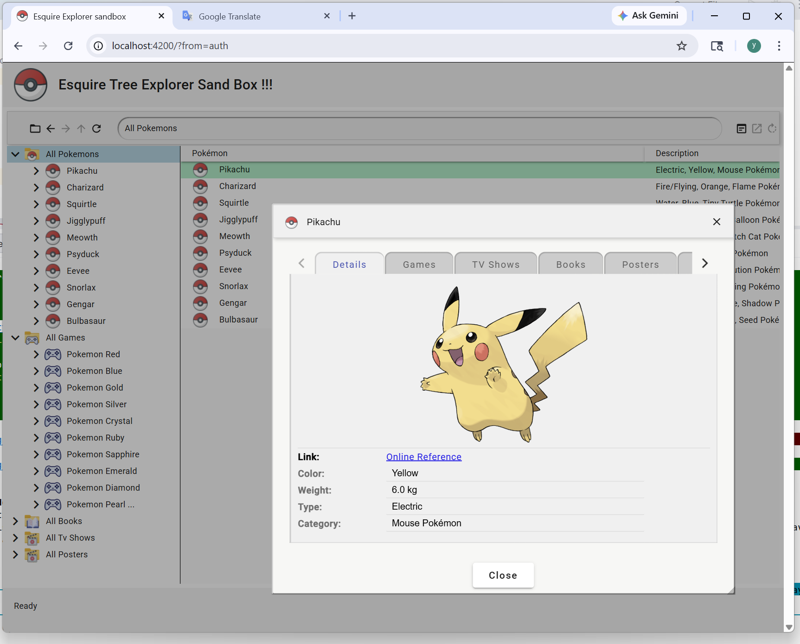

||Esquire Frameworks™ 2.0|
|:-|:-|

A framework for organizing business entities in a tree — organizations, users, accounts,
any kind of business or activity. Targets the classic backoffice feature set: entity management,
permissions, onboarding, accounting operations.

## esquire.explorer.sandbox

A **read-only demonstration and tutorial** environment for the
[`@mir0n-pro/esquire.ui`](https://github.com/mir0n-pro/esquire.ui.lib) library **v1.2.2**.

Explore what the library delivers out of the box — without writing a single line of business
logic. The backend stub serves static data; the frontend is a fully wired Esquire Explorer
showing exactly what a production host application looks like.

**What makes it interesting:**
the UI has no hardcoded field definitions or layouts. Everything you see — entity categories,
dialog tabs, field types, validation rules, available commands — is driven by the backend
configuration at runtime. Change the server response and the UI adapts automatically.



### What to look for

From a user experience perspective the sandbox demonstrates:

- **Entity tree** — lazy-loaded, keyboard-navigable hierarchy of organizations, users, and accounts
- **Context menu** — right-click any tree node to see the commands available for that entity kind
- **Toolbar** — mirrors the context menu for the selected node; updates as you navigate
- **Details dialog** — dictionary-driven tabs and fields; read/write state controlled by the server
- **Freely resizable dialogs** — drag any corner or edge; position and size are remembered per user
- **Active footer** — live status and error reporting; RFC 9457 problem details surfaced without page reload
- **Keyboard navigation** — arrow keys, Enter, Delete, and Escape work throughout

---

## Stack

| | |
|---|---|
| Node.js | v24+ — [nodejs.org](https://nodejs.org/en) |
| Angular | v20.3 — [angular.dev](https://angular.dev) |
| `@mir0n-pro/esquire.ui` | v1.2.2 |

Backend and frontend run together in a single development environment.
The REST API is stubbed with static data; the OpenAPI spec and both client/server stubs
are generated with [openapi-generator.tech](https://openapi-generator.tech).

---

## Installation

Install Node.js, then from the sandbox root folder:

```
npm run prestart
```

---

## Run

```
npm run dev
```

Starts backend and frontend simultaneously.

| URL | |
|---|---|
| [localhost:4200](http://localhost:4200) | Esquire Explorer UI |
| [localhost:3000/api-docs/](http://localhost:3000/api-docs/) | REST API documentation |

Or try it instantly on StackBlitz:
[stackblitz.com/~/github.com/mir0n-pro/esquire.explorer.sandbox](https://stackblitz.com/~/github.com/mir0n-pro/esquire.explorer.sandbox)

---

## Further help

mailto:mir0n.the.programmer@gmail.com
